# Here are some new faces for TTGO T-Watch

To use this watchface, you must fisrt install [Sharandac/My-TTGO-Watch](https://github.com/sharandac/My-TTGO-Watch) firmware on your TTGO T-Watch.

Watchfaces develoment status
- Lyligo : ok
- Countour Apple : ok
- Rado : ok
- Armani Connect : ok
- Armani Exchange : ok
- Bell & Ross Ceramic Heritage: under dev
- Breitling B50 : under dev
- Fossil ME3127 : ok
- Mini Copper : ok
- Tag Heuer Carrera: under dev
- Victorinox Swiss Army : ok
- Victorinox Dimmed : ok
- Cartier Tank : ok
- Piaget Antik : ok
- Abstract Paper : ok

 

[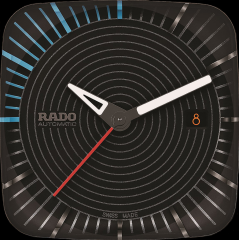](rado/watchface.tar.gz)

[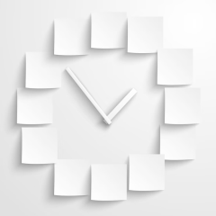](abstractpaper/watchface.tar.gz)

 

# Planned new watchfaces

- Bulova Acutron II : ok
- Feice Bauhaus : ok
- Gucci Diamonds : ok
- Hugo Boss : ok
- Louis Vuitton : ok
- Nomos Tetra Neomatik : ok
- Radii : draft
- Bell & Ross Raphale : ok
- Tag Heuer Monaco Gulf : ok

 

[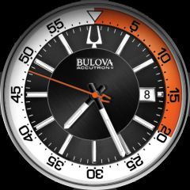](bulova/watchface.tar.gz)
[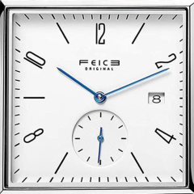](feice/watchface.tar.gz)
[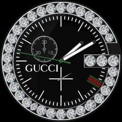](gucci/watchface.tar.gz)
[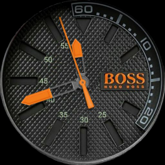](hugoboss/watchface.tar.gz)

[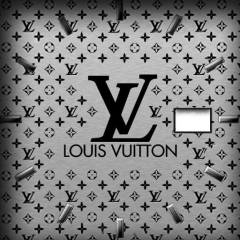](louisvuittonr/watchface.tar.gz)
[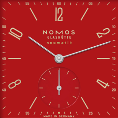](nomos/watchface.tar.gz)
[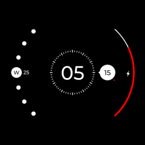](radii/watchface.tar.gz)
[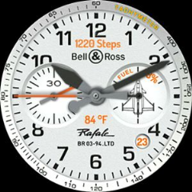](raphale/watchface.tar.gz)
[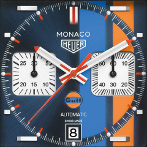](tagmonaco/watchface.tar.gz)

 

# Other repositories

The original [ Sharandac My-TTGO-Watchfaces](https://github.com/sharandac/My-TTGO-Watchfaces) for TTGO TWatch Clock. 

An overview of all [sharandac watchfaces repository](https://sharandac.github.io/My-TTGO-Watchfaces/).

You can find more watch faces by looking on GitHub for [topic my-ttgo-watch-face](https://github.com/topics/my-ttgo-watch-face) 

Watch faces documentation for [watchface_theme.json](https://github.com/sharandac/My-TTGO-Watch/blob/master/WATCHFACE.md) 

Another good place to find more watch faces by looking on GitHub for [PG-TTGO-Watchfaces](https://github.com/PGNetHun/PG-TTGO-Watchfaces).

Feel free to clone them and create yours!

