# Here are some new faces for TTGO T-Watch

Here you can find some finish watchface packages for [My-TTGO-Watch](https://github.com/sharandac/My-TTGO-Watch):

To use this watchface, you must fisrt install [Sharandac/My-TTGO-Watch](https://github.com/sharandac/My-TTGO-Watch) firmware on your TTGO T-Watch.

[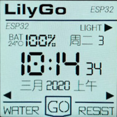](lilygo/watchface.tar.gz)
[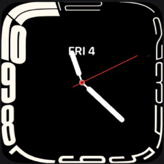](contour/watchface.tar.gz)
[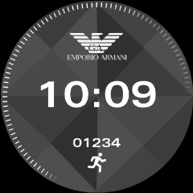](armanicon/watchface.tar.gz)
[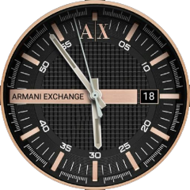](armaniex/watchface.tar.gz)
[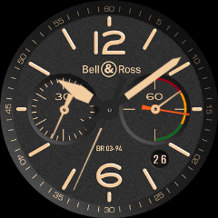](bellross/watchface.tar.gz)
[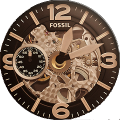](fossil/watchface.tar.gz)
[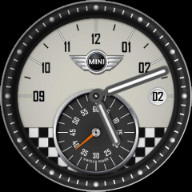](minicooper/watchface.tar.gz)
[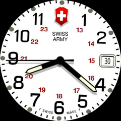](swissarmy/watchface.tar.gz)
[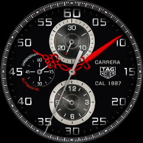](tagheuer/watchface.tar.gz)
[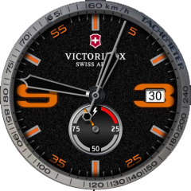](victorinox/watchface.tar.gz)

[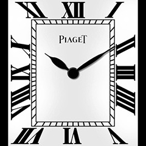](piaget/watchface.tar.gz)
[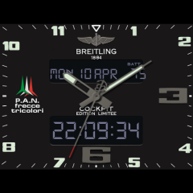](breitling/watchface.tar.gz)

# Original My-TTGO-Watchfaces

This is a fork of original Sharandac TTGO TWatch Clock Faces

# Other repositories

You can find more watch faces by looking on GitHub for [topic my-ttgo-watch-face](https://github.com/topics/my-ttgo-watch-face) 

An overview of all [sharandac watchfaces repository](https://sharandac.github.io/My-TTGO-Watchfaces/).

Watch faces documentation for [watchface_theme.json](https://github.com/sharandac/My-TTGO-Watch/blob/master/WATCHFACE.md) 

Another good place to find more watch faces by looking on GitHub for [PG-TTGO-Watchfaces](https://github.com/PGNetHun/PG-TTGO-Watchfaces).

Feel free to clone them and create yours!

